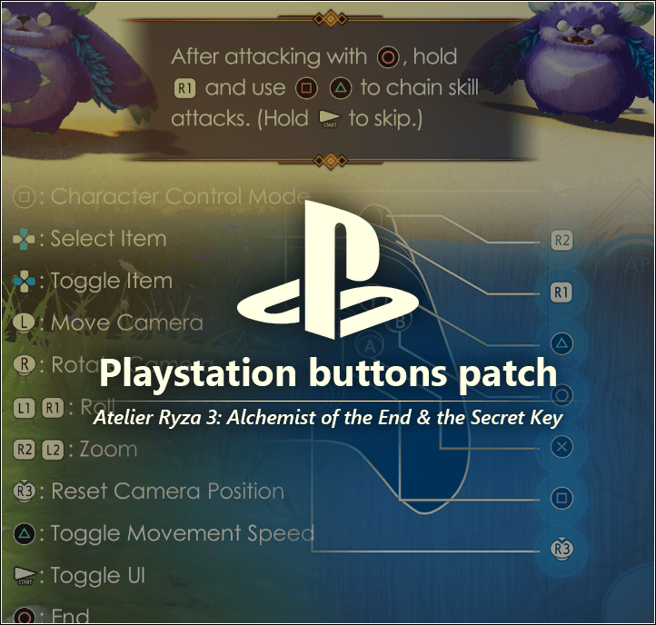
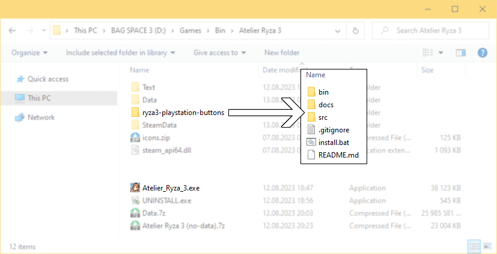
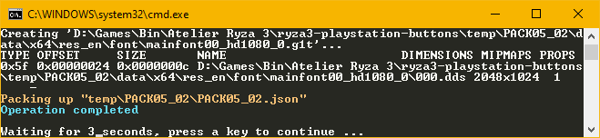

# Atelier Ryza 3: Alchemist of the End & the Secret Key - Playstation buttons patch
## Supported game version: 1.05

---

## Installation 
- Copy/unpack to main game directory, in such way that there is a subfolder

    

- Double click on `install.bat`

- *In case of game version mismatch, you will have to approve instalation
manually at your own risk*

- Done

    

# Thanks

- everyone who contributed to unpacking, decrypting, and packing it back at 
https://github.com/VitaSmith/gust_tools
- for great Windows Explorer integration of dds thumbnails
https://github.com/xMadHack/ImageWarp
- for making my workflow easier with Photoshop, since the plugin from nVidia
  does not support BC7
  https://github.com/GameTechDev/Intel-Texture-Works-Plugin
